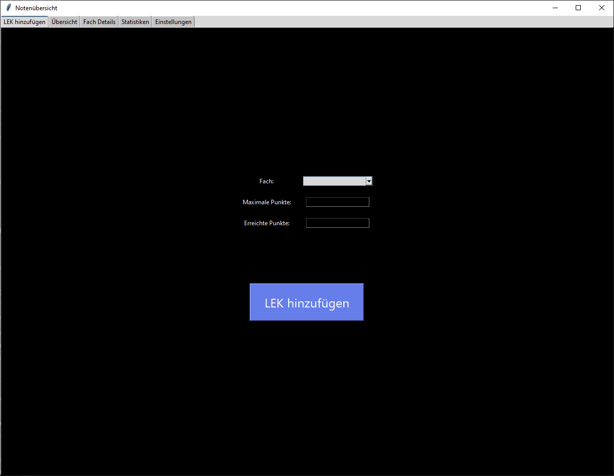
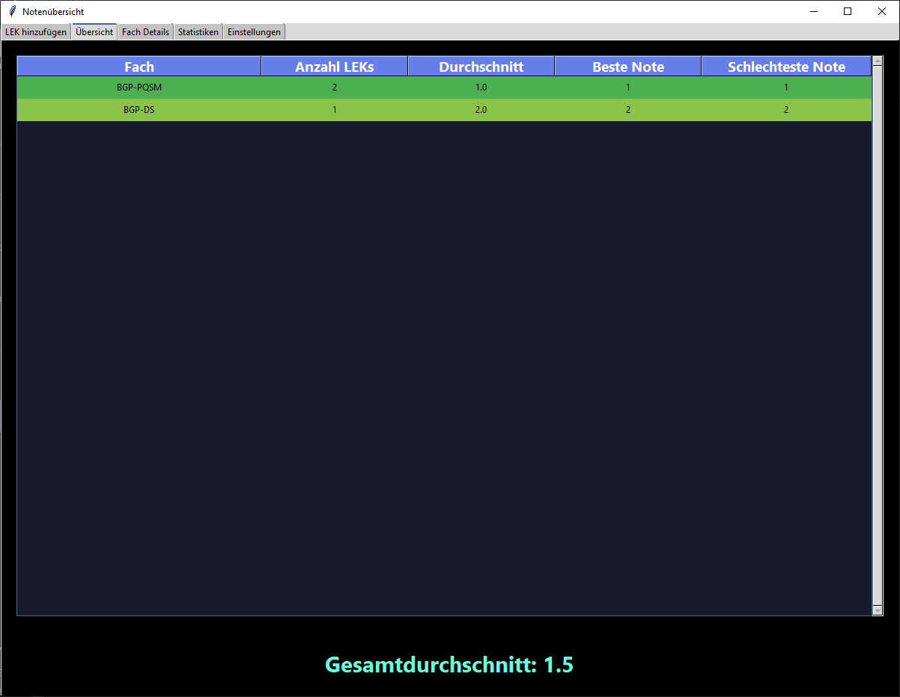
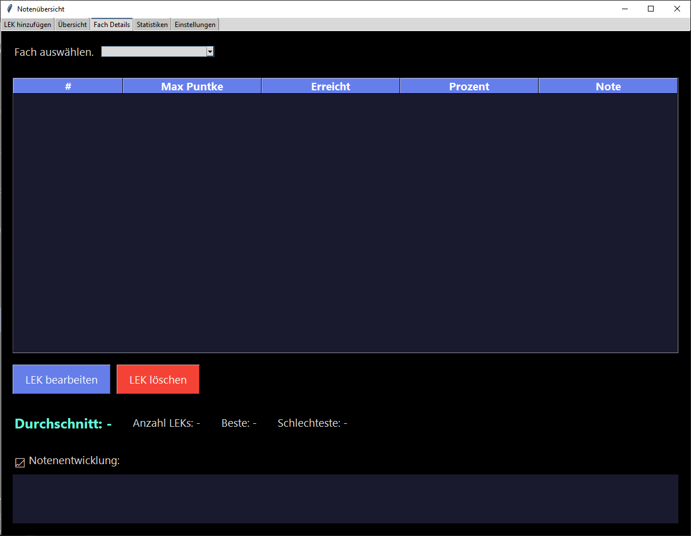
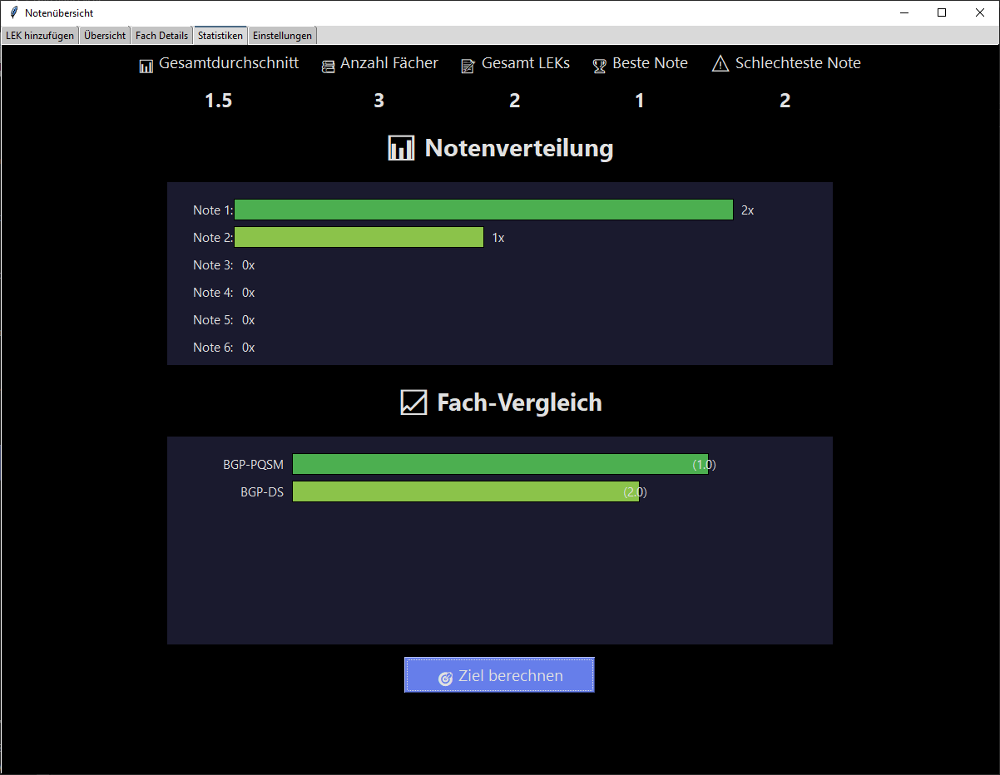
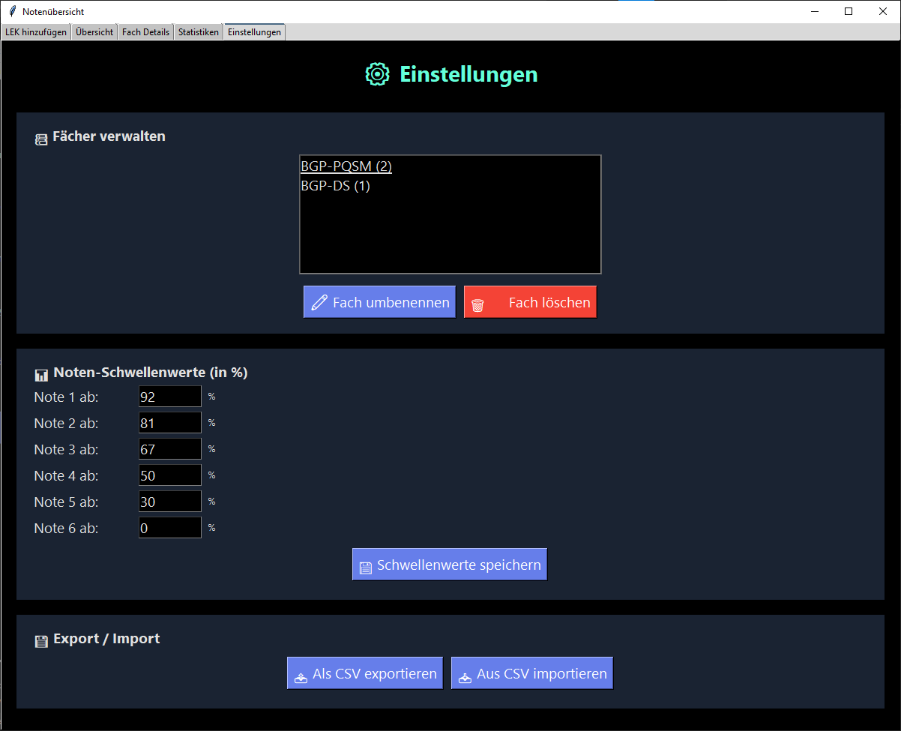

# 📊 Notenübersicht - LEK-Tracker

## Projektübersicht

Die **Notenübersicht** ist eine Desktop-Anwendung zur Verwaltung und Analyse von Lern-Erfolgs-Kontrollen (LEKs) während der Berufsausbildung. Das Programm wurde entwickelt, um Auszubildenden einen umfassenden Überblick über ihre schulischen Leistungen zu bieten und ihnen dabei zu helfen, ihre Lernziele effektiv zu planen und zu erreichen.

Die Anwendung berechnet automatisch Prozentwerte und Noten basierend auf eingegebenen Punktzahlen, visualisiert die Notenentwicklung über Zeit und ermöglicht eine detaillierte statistische Auswertung aller erfassten Leistungen. Durch die intuitive Benutzeroberfläche im Dark-Mode-Design ist die tägliche Nutzung angenehm und übersichtlich.

---

## Motivation und Hintergrund

Während meiner Umschulung zum Anwendungsentwickler stand ich vor der Herausforderung, den Überblick über meine zahlreichen LEKs in verschiedenen Fächern zu behalten. Bestehende Lösungen wie Excel-Tabellen waren umständlich und boten keine automatische Notenberechnung nach dem IHK-Notenschlüssel.

Aus diesem Bedarf heraus entstand die Idee, eine maßgeschneiderte Anwendung zu entwickeln, die genau auf die Anforderungen der Berufsausbildung zugeschnitten ist. Das Projekt diente gleichzeitig als praktische Übung, um meine Kenntnisse in Python und GUI-Entwicklung mit Tkinter zu vertiefen.

---

## Features im Detail

### Automatische Notenberechnung

Das Herzstück der Anwendung ist die automatische Berechnung von Prozentwerten und Noten. Der Benutzer gibt lediglich die erreichten und maximalen Punkte einer LEK ein, und das System berechnet sofort:

- Den **Prozentwert** auf zwei Dezimalstellen genau
- Die entsprechende **Note** nach dem konfigurierbaren Notenschlüssel
- Eine **farbcodierte Anzeige** von Grün (Note 1) bis Rot (Note 6)

Die Live-Vorschau zeigt diese Berechnung bereits während der Eingabe an, sodass der Benutzer sofort sieht, welche Note er erreicht hat.

### Fächerverwaltung

Die Anwendung ermöglicht die flexible Verwaltung beliebig vieler Unterrichtsfächer. Neue Fächer können direkt beim Hinzufügen einer LEK erstellt werden, bestehende Fächer lassen sich umbenennen oder vollständig löschen. Jedes Fach verwaltet seine eigene Liste von LEKs und berechnet automatisch den Notendurchschnitt.

### Statistische Auswertung

Der Statistik-Tab bietet einen umfassenden Überblick über alle erfassten Leistungen:

- **Gesamtdurchschnitt** über alle Fächer hinweg
- **Anzahl der Fächer** und **Gesamtzahl aller LEKs**
- **Beste und schlechteste Note** aus allen Prüfungen
- **Notenverteilung** als horizontales Balkendiagramm
- **Fächervergleich** zur Identifikation von Stärken und Schwächen

### Zielberechnung

Eine besonders nützliche Funktion ist die Zielberechnung, die zwei verschiedene Modi bietet:

1. **Punkteberechnung:** Der Benutzer gibt an, welche Note er bei einer bestimmten Maximalpunktzahl erreichen möchte, und das System berechnet die dafür benötigten Punkte.

2. **Durchschnittsplanung:** Der Benutzer wählt einen Ziel-Durchschnitt für ein Fach, und das System berechnet, welche Note in der nächsten LEK erforderlich ist, um dieses Ziel zu erreichen.

### Notenentwicklung

Für jedes Fach wird die Notenentwicklung als Liniendiagramm visualisiert. So lässt sich auf einen Blick erkennen, ob sich die Leistungen über Zeit verbessern oder verschlechtern. Die Datenpunkte sind farbcodiert entsprechend der jeweiligen Note.

### Anpassbare Schwellenwerte

Der Standard-Notenschlüssel entspricht den IHK-Vorgaben, kann aber in den Einstellungen individuell angepasst werden. So lässt sich die Anwendung auch für andere Bewertungssysteme nutzen. Die angepassten Schwellenwerte werden persistent gespeichert und beim nächsten Programmstart automatisch geladen.

### Datenexport und -import

Alle erfassten Daten können als CSV-Datei exportiert werden, was die Weiterverarbeitung in Excel oder anderen Programmen ermöglicht. Ebenso können Daten aus CSV-Dateien importiert werden, um beispielsweise bestehende Notenlisten zu übernehmen.

### Persistente Datenspeicherung

Sämtliche Daten werden automatisch im JSON-Format gespeichert. Beim Schließen der Anwendung gehen keine Daten verloren, und beim nächsten Start sind alle Fächer und LEKs wieder verfügbar. Die Speicherung erfolgt nach jeder Änderung automatisch im Hintergrund.

---

## Screenshots

### LEK hinzufügen


### Übersicht


### Fach-Details


### Statistiken


### Einstellungen


---

## Technische Umsetzung

### Architektur

Das Projekt folgt einer modularen Architektur mit klarer Trennung der Verantwortlichkeiten:

| Modul | Verantwortlichkeit |
|-------|-------------------|
| `main.py` | Einstiegspunkt der Anwendung |
| `constants.py` | Konfigurationswerte und Konstanten |
| `grade.py` | Datenmodell für einzelne LEKs |
| `subject.py` | Datenmodell für Fächer mit LEK-Verwaltung |
| `storage.py` | Persistenzschicht für JSON-Speicherung |
| `ui.py` | Gesamte Benutzeroberfläche mit Tkinter |

Diese Struktur ermöglicht eine einfache Wartung und Erweiterung des Codes. Jedes Modul hat eine klar definierte Aufgabe und kann unabhängig von den anderen getestet werden.

### Verwendete Technologien

- **Python 3:** Programmiersprache
- **Tkinter:** GUI-Framework für die Benutzeroberfläche
- **ttk:** Erweiterte Widgets für modernes Aussehen
- **JSON:** Datenspeicherung
- **CSV:** Datenexport und -import

### Design-Entscheidungen

**Dark Mode:** Die Entscheidung für ein dunkles Farbschema basiert auf der Erkenntnis, dass viele Entwickler und Auszubildende lange Stunden vor dem Bildschirm verbringen. Ein dunkles Design ist augenschonender und reduziert die Belastung bei längerer Nutzung.

**Modulare Struktur:** Anstatt den gesamten Code in eine einzige Datei zu schreiben, wurde das Projekt von Anfang an modular aufgebaut. Dies entspricht professionellen Entwicklungspraktiken und erleichtert die Zusammenarbeit in Teams.

**Automatische Speicherung:** Um Datenverlust zu vermeiden, werden Änderungen sofort gespeichert. Der Benutzer muss sich nicht um manuelles Speichern kümmern.

---

## Installation und Ausführung

### Voraussetzungen

- Python 3.8 oder höher
- Tkinter

### Installation

1. Repository klonen:
```bash
git clone https://github.com/rwarny/notenuebersicht.git
```

2. In das Projektverzeichnis wechseln:
```bash
cd notenuebersicht
```

3. Anwendung starten:
```bash
python main.py
```

Es sind keine zusätzlichen Abhängigkeiten erforderlich, da die Anwendung ausschließlich Python-Standardbibliotheken verwendet.

---

## Bedienungsanleitung

### LEK hinzufügen

1. Im Tab "LEK hinzufügen" ein Fach aus dem Dropdown auswählen oder "Neues Fach..." wählen
2. Bei neuem Fach den Fachnamen eingeben
3. Maximale Punktzahl der LEK eingeben
4. Erreichte Punktzahl eingeben
5. Die Live-Vorschau zeigt sofort Prozent und Note an
6. Mit "LEK hinzufügen" bestätigen

### Noten verwalten

- **Übersicht:** Zeigt alle Fächer mit Durchschnitt auf einen Blick
- **Fach-Details:** Doppelklick auf ein Fach öffnet die Detailansicht
- **Bearbeiten:** LEK auswählen und "LEK bearbeiten" klicken
- **Löschen:** LEK auswählen und "LEK löschen" klicken

### Einstellungen anpassen

- **Fächer verwalten:** Umbenennen oder Löschen von Fächern
- **Schwellenwerte:** Notengrenzen individuell anpassen
- **Export/Import:** Daten als CSV speichern oder laden

---

## Projektstruktur

```
notenuebersicht/
│
├── main.py              # Einstiegspunkt - startet die Anwendung
├── constants.py         # Noten-Schwellenwerte, Farben, UI-Konstanten
├── grade.py             # Grade-Klasse für einzelne LEKs
├── subject.py           # Subject-Klasse für Fächer
├── storage.py           # JSON-Speicherung und -Ladung
├── ui.py                # Komplette Benutzeroberfläche
│
├── grades.json          # Gespeicherte Noten (automatisch erstellt)
├── settings.json        # Benutzereinstellungen (automatisch erstellt)
│
└── README.md            # Diese Dokumentation
```

---

## Lerneffekte und Erkenntnisse

Die Entwicklung dieses Projekts hat mir wertvolle Erfahrungen in verschiedenen Bereichen der Softwareentwicklung vermittelt:

### Objektorientierte Programmierung

Durch die Implementierung der Klassen `Grade` und `Subject` habe ich ein tieferes Verständnis für Kapselung, Klassenbeziehungen und die Vorteile einer objektorientierten Struktur entwickelt. Die klare Trennung zwischen Datenmodell und Benutzeroberfläche hat die Entwicklung erheblich vereinfacht.

### GUI-Entwicklung mit Tkinter

Die Arbeit mit Tkinter hat mir gezeigt, wie komplexe Benutzeroberflächen mit mehreren Tabs, Tabellen, Canvas-Elementen für Diagramme und verschachtelten Layouts aufgebaut werden. Besonders die Implementierung der Live-Vorschau und der dynamischen Charts war lehrreich.

### Datenpersistenz

Die Implementierung der JSON-Speicherung hat mir verdeutlicht, wie Objekte serialisiert und deserialisiert werden. Die Entscheidung, die Speicherung in ein eigenes Modul auszulagern, hat sich als richtig erwiesen und könnte in Zukunft einfach durch eine Datenbankanbindung ersetzt werden.

### Fehlerbehandlung

Durch die systematische Implementierung von Validierungen und Try-Except-Blöcken habe ich gelernt, robuste Anwendungen zu entwickeln, die auch bei Fehlbedienung stabil bleiben und hilfreiche Fehlermeldungen anzeigen.

---

## Mögliche Erweiterungen

Für zukünftige Versionen sind folgende Erweiterungen denkbar:

- **Mehrere Farbthemen:** Light Mode und weitere Theme-Optionen
- **Notengewichtung:** Unterschiedliche Gewichtung für verschiedene LEK-Typen
- **Datumserfassung:** Zeitliche Einordnung der LEKs
- **Diagramm-Export:** Speichern der Charts als Bilddateien
- **Prognose-Funktion:** Vorhersage des Endnotendurchschnitts
- **Cloud-Synchronisation:** Datensicherung in der Cloud
- **Multi-User:** Unterstützung für mehrere Benutzerprofile

---

## Autor

Entwickelt von **Rosy Warny** im Rahmen der Umschulung zum Fachinformatiker für Anwendungsentwicklung.

---

## Lizenz


Dieses Projekt ist unter der MIT-Lizenz lizenziert. Siehe [LICENSE](LICENSE) für weitere Details.
